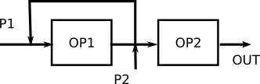
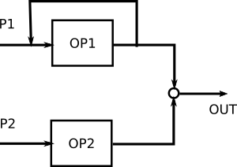
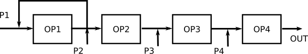
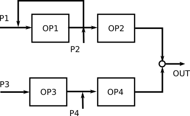
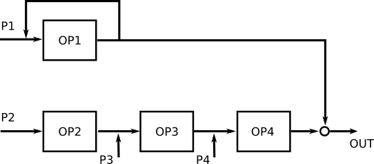
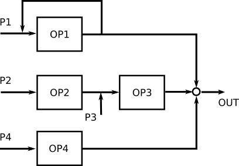

# OPL4 FM part

## Slot No in 4OP

| チャンネル | OP1 | OP2 | OP3 | OP4 |
| ---------- | --- | --- | --- | --- |
| 1          | 1   | 4   | 7   | 10  |
| 2          | 2   | 5   | 8   | 11  |
| 3          | 3   | 6   | 9   | 12  |
| 4          | 19  | 22  | 25  | 28  |
| 5          | 20  | 23  | 26  | 29  |
| 6          | 21  | 24  | 27  | 30  |

## WS

| WS | 0                      | 1                      | 2                      | 3                      |
| -- | ---------------------- | ---------------------- | ---------------------- | ---------------------- |
|    |  |  |  |  |

| WS | 4                      | 5                      | 6                      | 7                      |
| -- | ---------------------- | ---------------------- | ---------------------- | ---------------------- |
|    |  |  |  |  |

## CNT 2OP

| CNT | 0                         | 1                         |
| --- | ------------------------- | ------------------------- |
|     |  |  |

## CNT 4OP

| CNT |                                  |
| --- | -------------------------------- |
| 00  |  |
| 01  |  |
| 10  |  |
| 11  |  |

# OPL4 WaveTable Part

## PAN

| PAN | 0 | 1  | 2  | 3  | 4   | 5   | 6   | 7  |
| --- | - | -- | -- | -- | --- | --- | --- | -- |
| L   | 0 | -3 | -6 | -9 | -12 | -15 | -18 | -∞ |
| R   | 0 | 0  | 0  | 0  | 0   | 0   | 0   | 0  |

| PAN | 8  | 9  | 10  | 11  | 12  | 13 | 14 | 15 |
| --- | -- | -- | --- | --- | --- | -- | -- | -- |
| L   | -∞ | 0  | 0   | 0   | 0   | 0  | 0  | 0  |
| R   | -∞ | -∞ | -18 | -15 | -12 | -9 | -6 | -3 |

## TL

| bit | D7  | D6  | D5 | D4 | D3   | D2    | D1     | - |
| --- | --- | --- | -- | -- | ---- | ----- | ------ | - |
| db  | -24 | -12 | -6 | -3 | -1.5 | -0.75 | -0.375 |   |

Total Level(db) = (-24xD7) + (-12xD6) + (-6xD5) + (-3xD4) + (-1.5xD3) + (-0.75xD2) + (-0.375xD1)

## DL

| bit | D7  | D6  | D5 | D4 | - | - | - | - |
| --- | --- | --- | -- | -- | - | - | - | - |
| db  | -24 | -12 | -6 | -3 |   |   |   |   |

Decay Level(db) = (-24xD7) + (12xD6) + (-6xD5) + (-3xD4) 

補足: すべてが1の場合は-93db

## MIX

| Value      | 0 | 1  | 2  | 3  | 4   | 5   | 6   | 7  |
| ---------- | - | -- | -- | -- | --- | --- | --- | -- |
| MIX LV(db) | 0 | -3 | -6 | -9 | -12 | -15 | -18 | -∞ |

